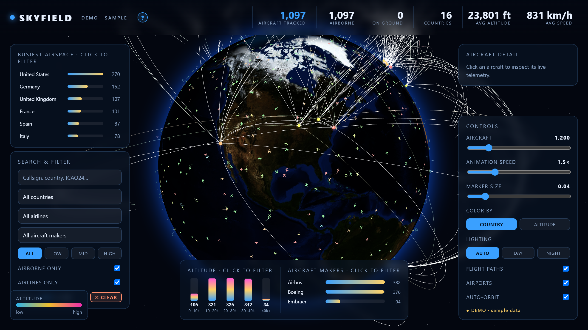
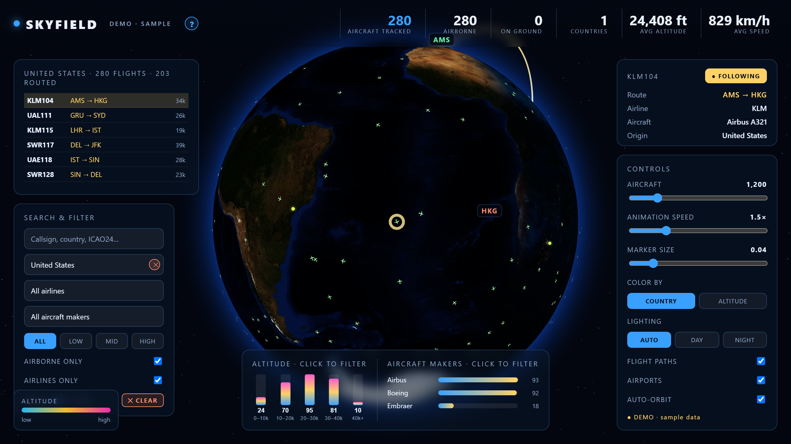
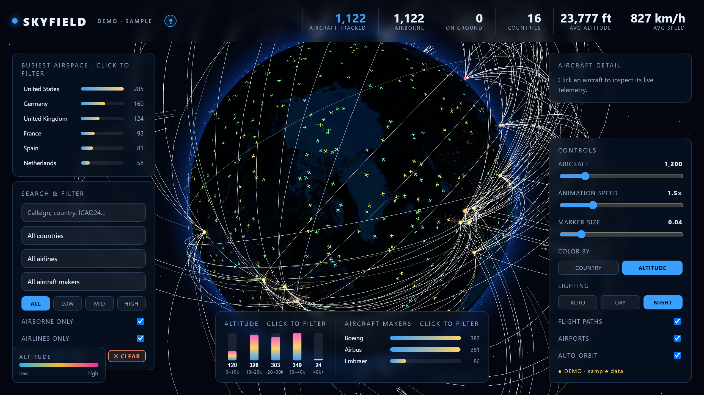
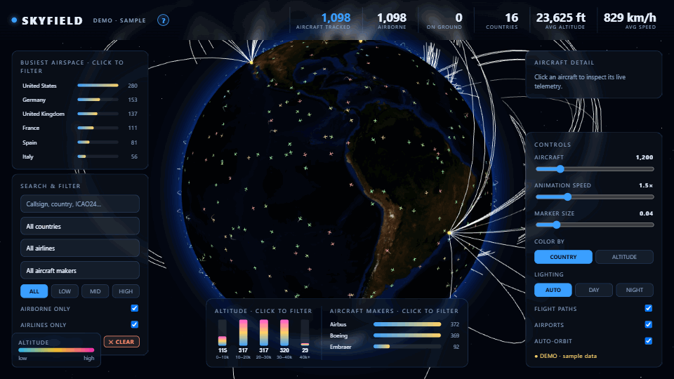

# Skyfield Intelligence — Live Flight Intelligence on Microsoft Fabric

A cinematic **3D globe of live aircraft**, built as a Microsoft **Fabric app (Rayfin)**.
Real aircraft positions from the OpenSky Network are streamed through **Fabric
Real-Time Intelligence** (Eventstream → Eventhouse), exposed through a Power BI
**semantic model**, and rendered with React + react-three-fiber inside the Fabric
portal.



| Drill into a country and follow an aircraft | Colour by altitude, night lighting |
|---|---|
|  |  |



> Screenshots are the **demo mode** (animated sample fleet). Inside the Fabric
> portal the app switches to **LIVE · Fabric** and plots the aircraft currently
> in the Eventhouse.

## Architecture (as deployed)

```
OpenSky /states/all (+ adsbdb route / airline / aircraft enrichment)
        │  Fabric notebook: opensky_to_eventstream (Spark, polling loop)
        ▼
Eventstream "flights"  (Custom endpoint source "flight_pipe")
        │
        ▼
Eventhouse "Flight_api" → KQL DB "Flight_api" → table Flights   (15-min retention)
        │  AzureDataExplorer.Contents, DirectQuery
        ▼
Semantic model "Flights"  ──DAX (TOPN 6000 by ingestedAt)──►  Skyfield Rayfin app
                                                              (AppBackend, static hosting)
```

| Fabric item (workspace *MK Rayfin Demo*, folder *Skyfield Intellignce*) | Type | In this repo |
|---|---|---|
| `skyfield-flight-intelligence` | AppBackend (Rayfin app) | [`skyfield-flight-intelligence/`](skyfield-flight-intelligence) — source |
| `Flights` | Semantic model (DirectQuery → Eventhouse) | [`fabric-items/Flights.SemanticModel`](fabric-items/Flights.SemanticModel) — TMDL |
| `Flights` | Report | [`fabric-items/Flights.Report`](fabric-items/Flights.Report) — PBIR |
| `Flight_api` | Eventhouse + KQL database | [`fabric-items/Flight_api.Eventhouse`](fabric-items/Flight_api.Eventhouse), [`fabric-items/Flight_api.KQLDatabase`](fabric-items/Flight_api.KQLDatabase) — schema, ingestion mapping, retention |
| `flights` | Eventstream | [`fabric-items/flights.Eventstream`](fabric-items/flights.Eventstream) — topology |
| `opensky_to_eventstream` | Notebook | [`fabric-notebooks/opensky_to_eventstream.py`](fabric-notebooks/opensky_to_eventstream.py) — June 2026 copy, credentials as placeholders |

`fabric-items/` uses the Fabric Git-integration folder format (`<name>.<Type>/` with
`.platform`), so the items can be re-created via Fabric Git integration or the
`updateDefinition` / `createItem` REST APIs.

## Features

- **3D Earth** with day/night textures, fresnel atmosphere, starfield, auto-orbit
- **Aircraft as an instanced mesh** (up to 5,000) coloured by **country** or **altitude**
- **Great-circle flight paths** and airport markers from route enrichment
- **Click / follow any aircraft**: callsign, route, airline, aircraft type, altitude, speed, heading
- **HUD**: KPI strip, busiest-airspace bars, altitude-band histogram, aircraft-maker bars — all click-to-filter
- **Search & filter** by callsign / ICAO24 / country / airline / maker / altitude band
- Fits the fixed **1280×720 Fabric canvas** with zero page scroll

## Repository layout

```
skyfield-flight-intelligence/   The Rayfin app (Vite + React 18 + three.js / r3f, @microsoft/fabric-app-data)
fabric-items/                   Exported Fabric item definitions (semantic model, report, Eventhouse, KQL DB, Eventstream)
fabric-notebooks/               OpenSky → Eventstream ingestion notebook (Python)
fabric-live-api-backend/        Optional Node/TS ingestion + write-back service (alternative to the notebook)
FABRIC_DEPLOYMENT.md            End-to-end runbook: publish shell → build pipeline → go live
docs/media/                     Screenshots and GIF
```

## Run locally (demo mode)

```bash
cd skyfield-flight-intelligence
npm install
npm run dev        # http://localhost:5174 — animated sample fleet, no Fabric needed
npm test           # vitest (geo, great-circle, filter specs)
```

## Deploy / redeploy to Fabric

See [FABRIC_DEPLOYMENT.md](FABRIC_DEPLOYMENT.md). In short:

```bash
cd skyfield-flight-intelligence
cp fabric.yaml.example fabric.yaml            # workspaceId + semantic model itemId
cp rayfin/rayfin.yml.example rayfin/rayfin.yml
npx rayfin login
npx rayfin up --dry-run                       # check the target first
npx rayfin up
```

`fabric.yaml`, `rayfin/rayfin.yml` and `rayfin/.deployments.json` are personal
config and are git-ignored. `.deployments.json` (the pointer to the existing
AppBackend item) was not part of the surviving backup, so on a fresh machine
confirm with `--dry-run` that `rayfin up` targets the existing
`skyfield-flight-intelligence` AppBackend rather than creating a new one.

The ingestion notebook needs an OpenSky API client (`client_id` / `client_secret`)
and the Eventstream custom-endpoint connection string. **Never commit them**:
keep them in Azure Key Vault (`notebookutils.credentials.getSecret`) or paste
them only into the Fabric copy of the notebook.

## Provenance

The original working copy was lost in a 2026 laptop rebuild. This repo was
restored from a June 2026 backup on 2026-10-07 and **verified byte-identical to
the deployed app**: a production build of `skyfield-flight-intelligence/` (with
the real `fabric.generated.ts` ids) reproduces the live `index.html`,
`assets/index-A1pYMhnA.js`, `assets/index-UZLMZtKs.css` and both Earth textures
exactly. The Fabric item definitions were exported from the workspace the same
day via `getDefinition`.

---

Fan / learning project for Fabric + Rayfin + react-three-fiber, inspired by
[jeantimex/flights-tracker](https://github.com/jeantimex/flights-tracker).
Aircraft data © [OpenSky Network](https://opensky-network.org) contributors;
route enrichment via [adsbdb](https://www.adsbdb.com). MIT licensed.
